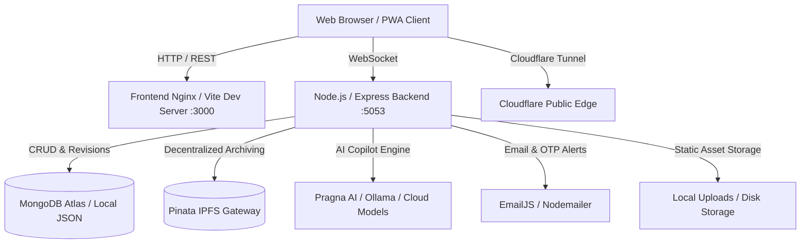

<div align="center">

# EtherX Word — Sovereign Document Studio

<p align="center">
  <strong>A Next-Generation, Web3 & Cloud-Native Word Processor with Microsoft Word-grade Ribbon, Real-time Collaboration, IPFS Decentralized Pinning, and Pragna AI Copilot.</strong>
</p>

<p align="center">
  <a href="#key-features">Key Features</a> •
  <a href="#system-architecture">Architecture</a> •
  <a href="#tech-stack">Tech Stack</a> •
  <a href="#quick-start">Quick Start</a> •
  <a href="#docker--minidock-deployment">Deployment</a> •
  <a href="#api-reference">API Docs</a> •
  <a href="#contributing">Contributing</a>
</p>

<p align="center">
  
  
  
  
  
  
  
  
</p>

---

</div>

## Overview

**EtherX Word** is an enterprise-grade, luxury dark-themed document processor engineered with the precision of classic desktop word processors (Microsoft Word) and powered by modern web technologies, AI workflows, and decentralized Web3 storage.

Built around a custom **Gold (`#d4af37`) on Obsidian Dark (`#0a0a0a`)** design language, it pairs typography (`Cinzel`, `Spectral`, `Crimson Pro`, and `JetBrains Mono`) with low-latency document manipulation, high-fidelity pagination, multi-format exports (DOCX, PDF, HTML, Markdown, EPUB), and live multi-user collaboration.

---

## Key Features

### Full-Featured Microsoft Word Ribbon
- **Home:** Font family, sizing, styling (bold, italics, underline, strike, sub/superscript), color palettes, text alignments, line spacing, list numbering, and quick-style templates.
- **Insert:** Tables (interactive 8×8 grid picker), image uploads with drag-and-resize, shapes, 3D models, SVG symbols, math equations, charts (Bar/Line/Pie with Chart.js), and video embeds.
- **Draw:** Canvas freehand pen, neon highlighters, eraser, stroke thickness controls, and color swatches.
- **Design & Layout:** Custom page margins (Normal, Narrow, Wide), paper orientations (Portrait/Landscape), page color tints, watermarks, headers & footers, page numbering, and line breaking.
- **References:** Table of Contents generation, bibliography & citation management, caption builders, and footnotes.
- **Mailings & Review:** Envelopes, labels, comments thread, spell check, track changes, digital signature verifications, and readability scoring (Flesch-Kincaid).
- **View:** Print layout, web layout, reading view, thumbnail navigation drawer, horizontal/vertical rulers, and fluid canvas zoom controls.

---

### Pragna AI Copilot & Live Web Grounding
- **Generative Writing:** Generate rich proposals, essays, outlines, or reports on command.
- **Document Optimization:** One-click executive summaries, tone shifting (formal, persuasive, corporate), and grammar correction.
- **Live Web Citations:** Ask questions and pull factual context directly from the live web into your document.
- **Chat Sidebar:** Interactive conversational assistant with document context awareness.

---

### Decentralized Storage & Web3 Sovereign Archiving
- **IPFS Pinning via Pinata:** Seal your documents permanently to InterPlanetary File System (IPFS) with cryptographic content addressing (CID).
- **Verifiable Document Integrity:** Export cryptographic hashes and verify document authenticity without vendor lock-in.

---

### Multi-Format Export & Import Engine
- **Import:** High-fidelity `.docx` document parsing using Mammoth and OCR image-to-text with Tesseract.js.
- **Export:** Export pixel-perfect `.pdf` (with jsPDF & html2canvas), native `.docx`, standalone `.html`, clean `.md` (Markdown), and standard `.epub` for e-readers.

---

### Real-Time Collaboration & Role Security
- **Multiplayer Editing:** Live cursor tracking, multi-user presence indicators, and synchronized document editing via WebSockets.
- **Granular Access Control:** Owner, Editor, Commenter, and Viewer security tiers.
- **Revision History:** Automatic snapshotting, manual version naming, diff viewing, and one-click rollback.

---

## System Architecture



### State Management Topology
```
useDocumentStore  ──► Content JSON/HTML, title, save states, versions, collaborators
useUIStore        ──► Active ribbon tab, dialog modals, toast alerts, sidebar toggles
useEditorStore    ──► Active Tiptap editor reference, selection marks, focus nodes
useCollaboration  ──► WebSocket room state, remote cursors, presence awareness
```

---

## Tech Stack

| Layer | Technologies |
|---|---|
| **Frontend Framework** | React 18, Vite 5.4, React Router v6 |
| **Editor Core** | Tiptap v2, ProseMirror PM Engine |
| **State Management** | Zustand v5 (Modular Stores) |
| **Styling & Aesthetics** | Pure Vanilla CSS Tokens, CSS Variables, Glassmorphism, Luxury Gold Palette |
| **Document Processing** | Docx.js, jsPDF, html2canvas, Mammoth, Tesseract.js, Date-fns |
| **Data Visualizations** | Chart.js 4, React-Chartjs-2 |
| **Backend Runtime** | Node.js (v18+), Express 4.19 |
| **Databases** | MongoDB Atlas with Mongoose (with fallback Local JSON engine) |
| **Web3 & Cloud** | IPFS (Pinata SDK), Cloudflare Tunnel (Cloudflared) |
| **Authentication** | JWT (JSON Web Tokens), Bcrypt.js, OTP Email Verification |
| **Containerization** | Docker, Docker Compose, Linux Minidock |

---

## Repository Layout

```text
WORD-UPDATED/
├── backend/
│   ├── config/             # Database connection & index migrations
│   ├── data/               # Local JSON fallback storage & seed documents
│   ├── middleware/         # JWT authentication & route security guards
│   ├── models/             # Mongoose schemas (Document, User, OTP)
│   ├── routes/             # REST Endpoints (auth, documents, ai, upload, templates)
│   ├── utils/              # IPFS Pinata integration, EmailJS/Nodemailer, Ollama AI
│   ├── server.js           # Express API server entry point & WebSocket handlers
│   ├── Dockerfile          # Containerized backend build specification
│   └── package.json        # Backend dependencies & runtime scripts
│
├── frontend/
│   ├── public/             # Static icons, web app manifest, and service worker
│   ├── src/
│   │   ├── components/     # UI widgets, Ribbon tabs, dialog modals, canvas
│   │   ├── hooks/          # Tiptap setup, auto-save, collaboration, shortcuts
│   │   ├── pages/          # Auth pages (SignIn/SignUp), Dashboard (Home), Editor
│   │   ├── services/       # API clients, export converters, WebSockets, IPFS
│   │   ├── store/          # Zustand state stores (Document, UI, Editor)
│   │   ├── theme/          # Design tokens, CSS variables, typography definitions
│   │   ├── App.jsx         # Application routing & authentication boundaries
│   │   └── main.jsx        # App mounting & splash loader
│   ├── Dockerfile          # Multi-stage containerized frontend build
│   └── vite.config.js      # Vite build pipeline & reverse proxy routing
│
├── docs/                   # Architecture blueprints, specs & roadmap documentation
├── docker-compose.yml      # Multi-container orchestration (Backend + Frontend + Cloudflare)
├── run-minidock.sh         # Isolated Linux rootfs sandbox runner
└── stop-minidock.sh        # Container shutdown utility
```

---

## Quick Start Guide

### Prerequisites
- **Node.js**: v18.0.0 or higher
- **npm**: v9.0.0 or higher
- **MongoDB**: Atlas connection URI or local instance (optional; falls back to JSON storage automatically)

### 1. Clone the Repository
```bash
git clone https://github.com/PadmajaBiswa1/WORD-UPDATED.git
cd WORD-UPDATED
```

### 2. Configure Environment Variables

Create `backend/.env`:
```env
PORT=5053
MONGO_URI=your_mongodb_connection_string
JWT_SECRET=your_super_secret_jwt_key
JWT_EXPIRES_IN=7d
FRONTEND_URL=http://localhost:3000

# Optional: IPFS Pinata Storage
IPFS_ENABLED=false
PINATA_API_KEY=your_api_key
PINATA_API_SECRET=your_api_secret
PINATA_JWT=your_pinata_jwt

# Optional: Email Service for OTPs
EMAILJS_SERVICE_ID=your_service_id
EMAILJS_TEMPLATE_ID=your_template_id
EMAILJS_PUBLIC_KEY=your_public_key
EMAILJS_PRIVATE_KEY=your_private_key
```

Create `frontend/.env`:
```env
VITE_API_URL=http://localhost:5053/api
```

### 3. Run Backend Server
```bash
cd backend
npm install
npm run dev
# Backend runs on http://localhost:5053
```

### 4. Run Frontend Studio
```bash
cd ../frontend
npm install
npm run dev
# Frontend available at http://localhost:3000
```

---

## Docker & Container Deployment

### Running with Docker Compose
Run the entire production stack (Frontend, Backend, and optional Cloudflare tunnel) with a single command:

```bash
docker-compose up --build -d
```

- **Frontend:** `http://localhost:3000`
- **Backend API:** `http://localhost:5053`
- **Container Health:** Inspect with `docker-compose ps`

### Stopping the Stack
```bash
docker-compose down
```

---

## API Reference Overview

| Method | Endpoint | Description | Auth Required |
|---|---|---|---|
| `POST` | `/api/auth/signup` | Register a new user account | No |
| `POST` | `/api/auth/signin` | Authenticate and obtain JWT token | No |
| `GET` | `/api/documents` | Fetch all user documents | Yes |
| `POST` | `/api/documents` | Create a new document | Yes |
| `GET` | `/api/documents/:id` | Fetch specific document by ID | Yes |
| `PUT` | `/api/documents/:id` | Update document content and metadata | Yes |
| `DELETE` | `/api/documents/:id` | Remove document | Yes |
| `POST` | `/api/documents/:id/ipfs` | Pin document content to IPFS | Yes |
| `GET` | `/api/documents/:id/versions` | List revision history snapshots | Yes |
| `POST` | `/api/upload` | Upload images and attachments | Yes |
| `POST` | `/api/ai/action` | Execute Pragna AI writing assistance | Yes |
| `GET` | `/api/health` | Server heartbeat & status check | No |

---

## Contributing

Contributions make the open-source community an incredible place to learn, inspire, and create. Any contributions you make are **greatly appreciated**!

1. **Fork the Repository**
2. **Create your Feature Branch**:
   ```bash
   git checkout -b feature/AmazingFeature
   ```
3. **Commit your Changes**:
   ```bash
   git commit -m "feat: Add AmazingFeature"
   ```
4. **Push to your Branch**:
   ```bash
   git push origin feature/AmazingFeature
   ```
5. **Open a Pull Request** against the `main` branch.

---

## License & Attribution

Distributed under the **MIT License**. Created with ❤️ by **[Padmaja Biswal](https://github.com/PadmajaBiswa1)** and contributors.
